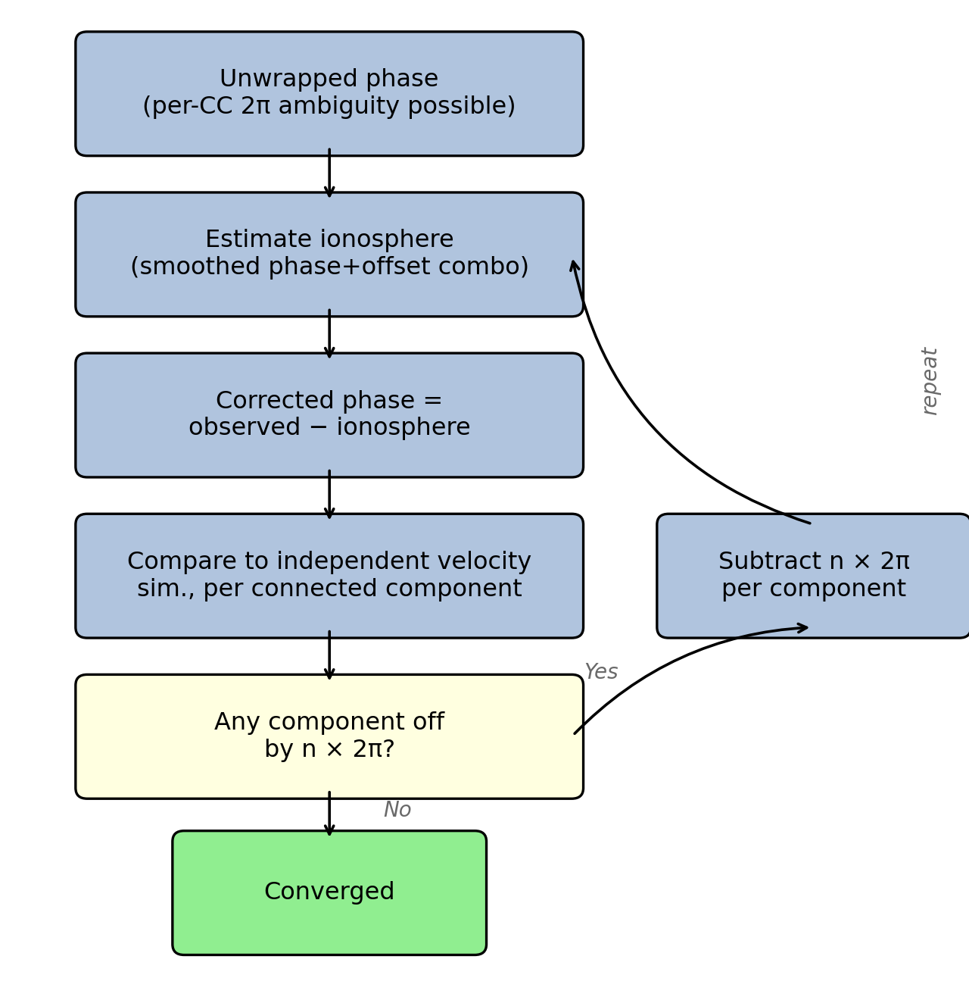

# estimateIonosphere.py

Estimates and removes the dispersive ionospheric phase from a NISAR RUNW interferogram by combining the unwrapped phase with independent range offsets. Because the ionosphere shifts the carrier phase and the group delay (range) in opposite directions and by equal amounts, their combination isolates the ionospheric signal. An iterative ambiguity-correction step (using an independent velocity simulation) resolves any integer-cycle (2π) unwrapping errors that survived the initial phase processing before the final ionosphere estimate is formed.

---

## Background and equations

### The dispersive ionosphere

For a transionospheric radar, the ionosphere is dispersive: it changes the phase velocity and group velocity of the signal in opposite senses. For a round-trip SAR acquisition the key results are:

**Phase contribution** (carrier phase advances through the ionosphere, appearing as a shortened path):

$$\Delta\phi_\mathrm{ion} = -\frac{4\pi}{\lambda} \cdot \frac{K \cdot \Delta\mathrm{TEC}}{f^2}$$

**Range offset contribution** (group delay slows the modulation envelope, making the range appear longer):

$$\Delta R_\mathrm{ion} = +\frac{K \cdot \Delta\mathrm{TEC}}{f^2}$$

where K ≈ 40.28 m³ s⁻² is the ionospheric constant, ΔTEC is the differential total electron content between the two acquisition times (electrons m⁻²), f is the radar frequency (Hz), and λ = c/f is the wavelength. The crucial point is that these two effects are equal in magnitude but opposite in sign:

$$\Delta\phi_\mathrm{ion} = -\frac{4\pi}{\lambda} \cdot \Delta R_\mathrm{ion}$$

### Combining phase and offset

The observed interferometric phase is:

$$\phi_\mathrm{obs} = \phi_\mathrm{signal} + \Delta\phi_\mathrm{ion}$$

where φ_signal is the non-dispersive component (surface deformation, topography, troposphere, orbit). The residual range offset after removing the geometry-only simulation (which accounts for topography and orbit) is approximately the ionospheric group-delay component:

$$\delta R \approx \Delta R_\mathrm{ion}$$

Converting this to an equivalent phase using the dispersive relation:

$$\phi_\mathrm{offset} \equiv -\frac{4\pi}{\lambda} \cdot \delta R = \Delta\phi_\mathrm{ion}$$

Note the sign: because phase and group delay have opposite signs, multiplying the (positive) range offset by −4π/λ gives the (negative, for positive ΔTEC) ionospheric phase contribution directly. Substituting into the expression for the observed phase:

$$\phi_\mathrm{obs} + \phi_\mathrm{offset} = (\phi_\mathrm{signal} + \Delta\phi_\mathrm{ion}) + \Delta\phi_\mathrm{ion}
                                           = \phi_\mathrm{signal} + 2\,\Delta\phi_\mathrm{ion}$$

A heavy spatial Gaussian smooth (σ_az ≈ 10 px, σ_rg ≈ 30 px) eliminates the spatially variable signal component, leaving only the slowly-varying ionosphere:

$$\Delta\phi_\mathrm{ion} \approx \mathrm{smooth}\!\left(\frac{\phi_\mathrm{obs} + \phi_\mathrm{offset}}{2}\right)$$

The corrected phase is then:

$$\phi_\mathrm{corrected} = \phi_\mathrm{obs} - \Delta\phi_\mathrm{ion}$$

### Sign convention and applied corrections

All corrections are defined so that they are **added** to the measured quantity to remove the ionospheric error.

**Phase correction** (radians, on the RUNW grid):

$$\Delta\phi_\mathrm{correction} = -\Delta\phi_\mathrm{ion}
\qquad\Rightarrow\qquad
\phi_\mathrm{corrected} = \phi_\mathrm{obs} + \Delta\phi_\mathrm{correction}$$

**Range-offset correction** (SLC pixels, on the offset-VRT grid):

$$\Delta R_\mathrm{correction} = \frac{\lambda}{4\pi\,\Delta_\mathrm{slp}}\,\Delta\phi_\mathrm{ion}
\qquad\Rightarrow\qquad
\delta R_\mathrm{corrected} = \delta R_\mathrm{obs} + \Delta R_\mathrm{correction}$$

where Δ_slp is the SLC range pixel spacing in metres.

**Concrete sign example (ΔTEC > 0):**

| Quantity | Sign | Physical meaning |
|---|---|---|
| Δφ_ion | **negative** | iono shortens phase path; observed phase too negative |
| Δφ_correction = −Δφ_ion | **positive** | adds positive value → restores phase toward truth |
| ΔR_ion (group delay) | **positive** | iono inflates apparent range; observed offset too large |
| ΔR_correction = (λ/4π·Δslp)·Δφ_ion | **negative** | adds negative value → reduces inflated range offset |

The opposite signs of the two corrections reflect the physics: because iono shifts phase and group delay in opposite directions, the phase correction and the range correction must also have opposite signs — but both are added, not subtracted.

### Geometry removal

Before combining with the interferometric phase, the geometric contribution to the range offsets (from topography, orbital geometry, and look angle) is subtracted. `simoffsets` produces two simulated offset fields — one geometry-only (`offsets.geom`) and one including a velocity component (`offsets.velocity`). The residual

$$\delta R = (\delta R_\mathrm{meas} - \delta R_\mathrm{geom}) \times \Delta_\mathrm{slp}$$

(where Δ_slp is the SLC range pixel spacing in metres) isolates the ionospheric and noise components.

### Ambiguity correction



Unwrapping errors in the RUNW phase appear as connected components (CCs) whose mean phase is offset from neighbouring components by integer multiples of 2π. After a first-pass ionosphere estimate, the corrected phase is compared with an independent velocity simulation (velSim), which is produced by `siminsar` from a reference velocity map and DEM and is never involved in the ionosphere estimation. The per-CC mean of

$$\Delta\phi_k = \overline{(\phi_\mathrm{corrected} - \phi_\mathrm{velSim})}_k - c$$

(where c is the bias constant from the largest/reference CC) should be near zero for a correctly unwrapped component and near n × 2π for a component with an n-cycle error. The integer n is estimated as `round(Δφ_k / 2π)` and the correction `n × 2π` is subtracted from the original unwrapped phase before the ionosphere estimation is repeated.

Because the ionosphere estimation absorbs approximately half of each unwrapping error (the smooth iono picks up the low-frequency part of the jump), the apparent residual after correction is roughly n/2 rather than n. The loop therefore converges in at most ⌈log₂(N_max)⌉ passes; in practice one or two passes suffice.

---

## Usage

```
estimateIonosphere.py RUNW offsets.vrt output.vrt [options]
```

| Argument | Description |
|----------|-------------|
| `RUNW` | NISAR RUNW HDF5 file |
| `offsets.vrt` | Range offset VRT (band 1, SLC pixels, geographic SAR coordinates) |
| `output.vrt` | Output VRT path (multi-band named bands) |

---

## Options

| Option | Default | Description |
|--------|---------|-------------|
| `--frame N` | None | Frame number override passed to the RUNW reader. |
| `--regionFile YAML` | greenland | Region YAML for `defaultRegionDefs`; provides DEM and velocity map paths for `siminsar`. |
| `--overWrite` | False | Force `siminsar` to regenerate `velSim` and `maskVel` even if they already exist. |
| `--velThresh M/YR` | 100.0 | Velocity threshold (m/yr) for the `maskVel` `siminsar` call; pixels above this speed are excluded from the ionosphere fit. |
| `--sigma-az PX` | 10.0 | Azimuth Gaussian σ for smoothing the raw ionosphere estimate (pixels). |
| `--sigma-rg PX` | 30.0 | Range Gaussian σ (pixels). |
| `--offset-geometry VRT` | `offsets.geom.vrt` | Offset geometry VRT containing the `RangeOffsets` band to subtract from the measured offsets before ionosphere estimation. |
| `--maskFile FILE` | `None` (resolves to `<simDir>/maskVel.vrt` at runtime) | GeoTIFF or VRT mask; only mask=1 pixels contribute to the ionosphere fit. Created by `siminsar` if not supplied. |
| `--verticalCorrection FILE` | None | xyDEM grid (m/yr) of submergence/emergence rate; passed to the `velSim` `siminsar` call so its DC anchor matches `correctedUnwrappedPhase`. |
| `--sepIceRock` | off | Restrict the per-frame `(phase+offset_phase)/2` ionosphere estimate to ice pixels only (mask==2); rock/water excluded, since the estimate assumes nonzero velocity. The excluded rock pixels feed `SetupNISAR.globalFillIonosphere()`'s ice-anchored bias (see below). Requires `--iceRockMask` or an auto-detected `offsetSims/offsets.geom.mask.vrt`. |
| `--iceRockMask FILE` | None (auto-detects `offsetSims/offsets.geom.mask.vrt` in `--simDir`) | 3-value mask (0=water, 1=rock, 2=ice) for `--sepIceRock`. |
| `--simOffsets VRT` | `offsets.vrt` if present | VRT of simulated range offsets (SLC pixels) for per-CC diagnostic columns in the ambiguity table. |
| `--simDir DIR` | `.` (cwd) | Directory where `siminsar` outputs (`velSim.vrt`, `maskVel.vrt`) are written; created if absent. |
| `--noInterp` | off | Skip `intfloat` hole-filling of `correctedUnwrappedPhase`. |
| `--interpThresh N` | 20 | Maximum hole area (pixels) that `intfloat` will fill. |
| `--islandThresh N` | 20 | Maximum isolated-island area (pixels) that `intfloat` removes after filling. |
| `--phaseThresh RAD` | 14π | Mask `correctedUnwrappedPhase` where \|correctedPhase − simPhase\| ≥ RAD radians; screens regions of likely incorrect unwrapping. Masked pixels are written as −2×10⁹. |
| `--noPhaseThreshPass` | off | Disable the second-pass iono re-estimation (see below). By default, after Pass 1 converges a second pass re-estimates iono using the phase-residual mask instead of the velocity mask. |
| `--outputAll` | off | Write all 5 intermediate bands to a multi-band VRT (`ionosphereCorrection`, `correctedUnwrappedPhase`, `ionosphereCorrectionUnfilled`, `offsetPhase`, `unwrappedPhase`). Default: write only the 3 standard outputs as separate single-band VRTs. |
| `--debugIono` | off | Write extra diagnostic outputs to a `debug/` subdirectory alongside the main output: ambiguity-corrected unwrapped phase (`*.ambiguityCorrectedUnwrappedPhase.vrt`) and iono-corrected range offsets (`range.offsets.corrected.vrt`) in SLC pixel units. |
| `--verbose` | off | Print progress messages to stdout. |
| `--minTol M/YR` | None | Variable smoothing-radius map: m/yr floor for the adaptive tolerance `clip(percentSpeed/100*speed, minTol, maxTol)`, applied to `correctedUnwrappedPhase` as an additional pass on top of `intfloat` hole-filling. Required together with `--percentSpeed`/`--maxTol` to enable the map. |
| `--percentSpeed PCT` | None | Percent of local speed (e.g. `1` = 1%) used in the adaptive tolerance. Required together with `--minTol`/`--maxTol`. |
| `--maxTol M/YR` | None | m/yr ceiling for the adaptive tolerance. Required together with `--minTol`/`--percentSpeed`. |
| `--maxSmoothRadius N` | 50 | Sweep cap, single-look pixels, clamped to ≤ 255 (byte output). |
| `--smoothNIter N` | 3 | Repeated box-filter passes per sweep step (Gaussian-ish), used both by `run_vel_sim()`'s `siminsar` sweep and the `filterfloat` apply step. |
| `--noVariableSmoothing` | off | Disable the variable smoothing-radius map even if `--minTol`/`--percentSpeed`/`--maxTol` (or `project.yaml`) supply values. |

---

## Processing flow

```
load_runw()                — open RUNW HDF; read unwrappedPhase, connectedComponents,
                             wavelength, SLC pixel spacing, geotransform

apply_runw_mask()          — zero pixels excluded by the interferogram mask

run_vel_sim()              — siminsar: generate velSim.vrt (radians, RUNW grid)
                             skipped if velSim already exists and --overWrite not set
                             [if --minTol/--percentSpeed/--maxTol] also generates
                             velSim.smr(.vrt), a per-pixel smoothing-radius map; the
                             siminsar call (and this skip check) is re-run if the radius
                             map was requested but is missing from a prior run

run_mask_vel()             — siminsar: generate maskVel.vrt (velocity threshold mask)
                             skipped if maskVel.vrt already exists

load_offset_vrt()          — read range offsets (SLC pixels)
load_geom_vrt()            — read geometry RangeOffsets band (SLC pixels)
offset_m = (meas − geom) × SLC_pixel_size
resample_vrt_to_runw()     — bilinear resample offset_m to RUNW multilooked grid
offset_phase = offset_m × (−4π / λ)

load_mask_file()           — load maskVel.vrt (or --maskFile); resample if needed

for pass in 1..MAX_PASSES:
    estimate_and_correct()
      raw_iono = (offset_phase + phase) / 2
      valid = finite(raw_iono) & (cc ≠ 0) & mask
      fill_and_smooth_iono()
        Stage 1: NN seed     — each gap pixel ← nearest valid neighbour
        Stage 2: pyramid fill — coarse-to-fine diffusion (4 levels × 50 iters;
                                coarsest level gets 100 iters)
        Stage 3: Gaussian smooth — σ = (σ_az, σ_rg), default (10, 30) px
      iono_final -= mean(iono_final)    — zero-mean adjustment
      phase_final = phase − iono_final

    ambiguity_table()      — compare phase_final with velSim per CC;
                             compute bias c from reference (largest) CC;
                             return n_map: {cc → nearest integer n}

    if all n == 0: break   — converged

    apply_ambiguity_correction()
                           — subtract n × 2π from each CC of original phase;
                             update phase for next pass

[if --phaseThresh set]
thresh_mask = |phase_out − vel_sim − bias| ≥ phaseThresh
phase_out[thresh_mask] = NaN

[Pass 2 — unless --noPhaseThreshPass]
pass2_mask = ~thresh_mask & finite(phase_out) & (cc ≠ 0)
  — pixels whose corrected phase already agreed with vel_sim (residual < phaseThresh)
  — more principled than velocity mask: includes fast areas with correct ambiguity,
    excludes only pixels with clear phase anomalies
  — circularity is limited: vel_sim is independent; iono is constrained smooth
for pass in 1..MAX_PASSES:
    estimate_and_correct(phase_from_pass1, pass2_mask)
    ambiguity_table() / apply_ambiguity_correction()
    if all n == 0: break
thresh_mask2 = |phase_out2 − vel_sim − bias| ≥ phaseThresh
phase_out2[thresh_mask2] = NaN
→ replace iono, phase_out, iono_unfilled, thresh_mask with Pass 2 results

[unless --noInterp]
run_intfloat()             — intfloat hole-fills correctedUnwrappedPhase into a temp
                             file (not in place); cc=0/phaseThresh pixels re-masked to -2e9
[if --minTol/--percentSpeed/--maxTol and velSim.smr.vrt exists]
filterfloat -radiusMap     — additional variable-radius smoothing pass: reads the temp
                             interpolated file + velSim.smr.vrt, writes final
                             correctedUnwrappedPhase.tif/.vrt
[else]                     — temp file renamed directly to correctedUnwrappedPhase.tif/.vrt

write_geotiff() × 5        — ionosphereCorrection, correctedUnwrappedPhase,
                             ionosphereCorrectionUnfilled, offsetPhase, unwrappedPhase
write_output_vrt()         — 5-band named VRT on RUNW grid

[if --debugIono]
write_geotiff() + write_output_vrt()
                           — debug/: ambiguityCorrectedUnwrappedPhase.vrt

resample_runw_to_vrt()     — regrid iono correction to offset VRT grid (SLC pixels)
write_geotiff() + write_output_vrt()
                           — single-band offset-grid VRT (ionosphereCorrection.offset.vrt)

[if --debugIono]
corrected = offset_slp − iono_offset_pix
write_geotiff() + write_output_vrt()
                           — debug/range.offsets.corrected.vrt (SLC pixels)
```

---

## Output files

All outputs are written relative to the stem of the `output` argument (e.g. `output = foo/bar.vrt` → stem = `foo/bar`).

### RUNW-grid outputs (SAR time/range coordinates)

| File | Band | Units | Description |
|------|------|-------|-------------|
| `<stem>.vrt` | 1 `ionosphereCorrection` | rad | Smoothed ionospheric phase estimate Δφ_ion (to be subtracted from observed phase). |
| | 2 `correctedUnwrappedPhase` | rad | Ionosphere- and ambiguity-corrected unwrapped phase. |
| | 3 `ionosphereCorrectionUnfilled` | rad | Raw (un-gap-filled) per-pixel ionosphere estimate; NaN where cc=0 or masked. |
| | 4 `offsetPhase` | rad | Range-offset-derived phase: −(4π/λ) × δR; equal to Δφ_ion before smoothing. |
| | 5 `unwrappedPhase` | rad | Original unwrapped phase after ambiguity corrections (before iono removal). |

### Offset-grid output (geographic coordinates of the offset VRT)

| File | Band | Units | Description |
|------|------|-------|-------------|
| `<stem>.offset.vrt` | 1 `ionosphereCorrection` | SLC px | Range-offset correction ΔR_correction = (λ/4π·Δslp)·Δφ_ion, regridded to the offset VRT grid in SLC pixel units. **Add** to the measured range offset (also in SLC pixels) to remove the ionospheric error. Sign is negative for ΔTEC > 0. |

### Debug outputs (`--debugIono` only)

Written to `debug/` alongside the main output directory.

| File | Band | Units | Description |
|------|------|-------|-------------|
| `debug/<stem>.ambiguityCorrectedUnwrappedPhase.vrt` | 1 | rad | Unwrapped phase after ambiguity correction only (before iono subtraction); useful for diagnosing how much the ambiguity loop changed the phase. |
| `debug/range.offsets.corrected.vrt` | 1 `RangeOffsetsCorrected` | SLC px | Raw range offsets minus the iono correction (`offset_slp − iono_offset_pix`); NaN/−2×10⁹ where either the measurement or the correction is missing. |

---

## Gap-filling and smoothing

The gap-fill + smooth pipeline (`fill_and_smooth_iono`) is applied to the raw
per-pixel ionosphere estimate before the final Gaussian smooth. Valid pixels are
those where cc ≠ 0 (connected component is not masked), the raw estimate is
finite, and the velocity mask allows the pixel. The pipeline runs in three stages.

### Stage 1 — Nearest-neighbour seed (`_nn_fill`)

Every invalid (gap) pixel is initialised to the value of its nearest valid
neighbour, found via `scipy.ndimage.distance_transform_edt`. This produces a
Voronoi-tessellated seed image with no NaN values.

The seed step is not the final fill: it is used solely to prevent NaN
propagation into the coarser pyramid levels. `scipy.ndimage.zoom` uses bilinear
interpolation (`order=1`), which would convert a single NaN pixel into a
spreading NaN patch at the coarser level. By seeding all gaps first, the
downsampling step sees only finite values.

### Stage 2 — Coarse-to-fine pyramid fill (`_pyramid_fill`)

The image is processed through a 4-level dyadic pyramid:

```
Level 0 — full resolution          (e.g. 1000 × 2000 px)
Level 1 — ½ resolution             (e.g.  500 × 1000 px)
Level 2 — ¼ resolution             (e.g.  250 ×  500 px)
Level 3 — ⅛ resolution (coarsest)  (e.g.  125 ×  250 px)
```

Each level is built with `ndimage.zoom(..., order=1)` (bilinear) for the data
array and `ndimage.zoom(..., order=0) > 0.5` (nearest-neighbour majority vote)
for the valid-pixel mask. The NN seed from Stage 1 ensures no NaN enters
the zoom.

**Coarsest level (Level 3) — double-weight fill:**
1. Re-apply NN fill on the coarse valid mask to guarantee all coarse pixels
   are initialised.
2. Run 100 convolution fill iterations (`iterations_per_level × 2`).

At ⅛ resolution, 100 iterations of a 3×3 kernel propagate information across
gaps of order 100 × pixel_size_coarse ≈ 100 × 8 = 800 full-resolution pixels,
efficiently seeding even the widest data voids.

**Upsample passes (Levels 3→2, 2→1, 1→0) — 50 iterations each:**

For each level `lvl` from 2 down to 0:
1. **Upsample** the current filled result to the dimensions of `arrs[lvl]`
   using bilinear zoom.
2. **Merge** with the original valid pixels at this level:
   ```
   merged[i,j] = arrs[lvl][i,j]   if validids[lvl][i,j]  (original data wins)
               = upsampled[i,j]    otherwise               (propagated fill)
   ```
3. **Refine** with 50 convolution fill iterations, which smooth the boundary
   between original data and upsampled fill values.

**Convolution kernel (`_FILL_KERNEL`):**

The 3×3 kernel used by `_conv_fill` is:

```
┌──────┬──────┬──────┐
│ 0.25 │ 0.50 │ 0.25 │
├──────┼──────┼──────┤
│ 0.50 │ 0.00 │ 0.50 │
├──────┼──────┼──────┤
│ 0.25 │ 0.50 │ 0.25 │
└──────┴──────┴──────┘    (raw weights, normalised by dividing by sum = 2.5)
```

After normalisation, face-adjacent neighbours have weight **0.20** and
corner-diagonal neighbours have weight **0.10**; the centre pixel has weight
**0**. This is a weighted 8-neighbour diffusion kernel — qualitatively similar
to a single step of explicit heat-equation diffusion on a 2-D grid.

At each iteration, only gap pixels are updated; valid pixels always retain
their original values, so the fill never modifies the measured data.

**Why coarse-to-fine?**

A purely fine-resolution diffusion fill with a 3×3 kernel propagates
information at roughly 1 pixel per iteration. Filling a gap of width *W*
pixels would require O(W) iterations — many thousands for ocean-size gaps.
The pyramid approach instead:

1. Represents the gap at ⅛ resolution, where its width is only *W*/8 pixels.
2. Runs 100 fine (coarse-pixel) iterations there — effectively propagating
   across 800 full-resolution pixels of gap.
3. Upsamples the coarse solution as an initial seed for progressively finer
   levels, each needing only 50 iterations to blend the seam between
   upsampled fill and real data.

Total computation is O(N log N) rather than O(N·W) and fills correctly across
the entire image regardless of gap size.

### Stage 3 — Final Gaussian smooth

`scipy.ndimage.gaussian_filter` with σ = (σ_az, σ_rg), nominally **(10, 30)**
pixels (`estimateIonosphere.py`'s own CLI defaults — `SetupNISAR.py`'s
`--sigmaAz`/`--sigmaRg` pass-throughs default to the same values), is applied
to the fully-filled image, removing the spatially variable surface-displacement
signal from the raw ionosphere estimate and leaving only the slowly-varying
ionospheric component.

**Note (flagged, not verified):** σ_rg (30) is currently larger than σ_az
(10) — more smoothing across range than along azimuth. An earlier version of
this doc asserted the opposite ratio was intentional ("ionospheric structures
are elongated in azimuth, aligned with the orbital track, so it gets more
smoothing"), which would argue for σ_az > σ_rg — the reverse of the current
defaults. Either the reasoning was wrong, the defaults changed for an
unrelated reason without the comment being revisited, or there's a
correct-but-different justification for σ_rg > σ_az that isn't captured
here. Worth confirming with whoever set these values rather than trusting
either explanation at face value.

---

## Ambiguity diagnostic table

`ambiguity_table` prints a table with one row per connected component:

| Column | Description |
|--------|-------------|
| `cc` | Connected-component label |
| `npix` | Total pixels in CC |
| `nfit` | Pixels with finite velSim overlap |
| `mean(rad)` | Mean of (corrected_phase − velSim) relative to reference CC bias |
| `median(rad)` | Median of the same residual |
| `sigma(rad)` | Standard deviation of the residual |
| `stderr(rad)` | Standard error of the mean (σ / √n); flagged `!` if > 0.1 cycles |
| `n_mean` | Nearest integer to mean / 2π — number of 2π cycles to remove |
| `n_median` | Nearest integer to median / 2π |
| `total_n` | Cumulative n across all passes (shown from pass 2 onward) |
| `off_mean`, `off_sig` | Mean and σ of iono-corrected offset residual (if `--simOffsets` given) |
| `note` | `*REF*` for reference CC; warnings for uncertain or inconsistent n |

The reference CC is the component with the most pixels. Its mean residual defines the global bias constant c; all other CCs are compared relative to it.

---

## Pipeline integration (`processFrameIonosphere`)

`estimateIonosphere` is normally invoked by `processFrameIonosphere` rather
than directly. That wrapper is called from `SetupNISAR.main()` immediately
after `processFrameROFF` completes for each frame, when
`--phaseDerivedIonosphere` is **not** selected.

```python
from nisargrimpworkflow.processFrameIonosphere import processFrameIonosphere
processFrameIonosphere(frame, myArgs, simDir='simPhase')
```

It resolves the required paths automatically:

| Input | Where it looks |
|-------|----------------|
| RUNW HDF5 | `{outputDir}/{orbit1}_{frame}/H5/NISAR*RUNW*.h5` (or same dir without `H5/`) |
| Range offset VRT | `{frameDir}/range.offsets.vrt` (or `H5/range.offsets.vrt`) |
| Geometry offset VRT | `{frameDir}/offsetSims/offsets.geom.vrt` (or `H5/...`) |

The output VRT is written to
`{frameDir}/{orbit1}_{frame}.{orbit2}_{frame}.{nLooksR}x{nLooksA}.nisar.vrt`.

Simulation outputs (`velSim`, `maskVel`) are written to `simDir` inside
`frameDir` (default `simPhase/`). The frame is skipped if the output VRT
already exists and neither `--overWrite` nor `--overWritePhase` is set.

---

## Global fill (`globalFillIonosphere`)

After per-frame `estimateIonosphere` produces sparse offset corrections (NaN where there
is no phase/offset overlap), `SetupNISAR.globalFillIonosphere()` assembles them across
all frames into a virtual-frame composite and fills globally to avoid frame-boundary
discontinuities caused by independent per-frame fills.

`arr` denotes this assembled, full-swath, sparse offset-grid ionosphere correction
(SLC pixels). When the per-frame step was run with `--sepIceRock`, `arr` only ever
contains ice-derived values (mask == 2) — rock (1) and water (0) pixels are excluded
from `arr` upstream, in `estimateIonosphere.estimate_and_correct()`'s `valid_iono` mask
(via `load_ice_rock_mask()`'s `ice_mask`), not here. `valid` denotes `isfinite(arr)`.

There are two mutually exclusive pre-fill strategies, selected by `--sepIceRock`,
both producing a denser `arr`/`valid` pair that is then passed to the same final
pyramid-fill-and-smooth call (below).

### Without `--sepIceRock`: ice-free pre-fill

Ice-free pixels (exposed rock, ocean) are pre-seeded with a direct ionospheric
range-offset estimate derived from geometry alone:

```
fill_value = offsets.geom [Band 1, SLC pixels] − range.offsets [Band 1, SLC pixels]
```

In ice-free areas the measured range offset contains only geometric (satellite geometry
+ topography) range change plus ionospheric range shift.  Subtracting the purely
geometric simulation removes the geometric part, leaving the iono estimate.  This is
the only direct iono measurement available in ice-free regions (no phase exists there).

The fill is applied only where all three conditions hold:

1. The ice mask (`offsetSims/offsets.geom.mask.vrt`) is **0** (not ice — rock or ocean).
2. The measured offset (`range.offsets.vrt` Band 1) is valid (not NaN / nodata).
3. The sparse iono correction is currently NaN (no phase-based estimate exists there).

The mask is produced by `simoffsets` using `IceRock90m.tif` via the `--iceRockWaterMask`
flag (passed automatically by `ROFFtoGrimp` for the `offsets.geom` simulation).
Mask values: **0 = water, 1 = rock, 2 = ice**.  Before seeding, rock pixels
(`mask == 1`) are morphologically eroded with a 5×5 kernel to pull back from
ice/water boundaries where sea-ice motion or other edge artefacts may be present.
Per frame, the pre-fill value is DC-aligned to the surrounding ice `arr` values
(`fv -= mean(rock fv) − mean(nearby ice arr)`) before a `local_consistency_mask`
gate decides which gap pixels actually get seeded — see code for the exact per-frame
mechanics; this path does not use a single global constant, unlike `--sepIceRock` below.

If `offsets.geom.mask.vrt` is absent for all frames, a bold-blue warning is printed
and the pre-fill step is skipped.

Sign convention (consistent with existing corrections):
```
fill_value = geom − measured   [SLC pixels]
```
Negative for positive ΔTEC (measured range > geometric range).  Consumers **add** the
correction, same as the phase-derived correction.

### With `--sepIceRock`: ice-anchored bias + independent rock truth

**History:** an earlier version of this procedure anchored `arr` to rock truth by
extrapolating the ice-derived estimate out to the rock locations (via a preliminary
`fill_and_smooth_iono` call) and comparing the two there. That design was replaced
(2026-06-22) after diagnosing `track-145/1801_0000`: a narrow band of badly
decorrelated phase data near one edge of the swath (~−180 rad, vs. a normal range of
roughly −66 to +39 rad elsewhere in that frame) was getting smoothed by the
extrapolation step and compared directly against nearby rock pixels, which happened
to be the densest rock cluster in the frame — corrupting the single global constant
for the *entire* swath. The current design never extrapolates ice data to evaluate it
at rock locations, and never compares ice and rock to each other at all.

**Step 1 — ice-anchored bias, directly on unfilled `arr`, vs. `offsets.velocity`.**
Ice pixels have real motion, so the comparison must be against the velocity-inclusive
simulation, not the zero-velocity `offsets.geom` — using `offsets.geom` would force
the bias to absorb the real velocity signal itself. For each ice pixel (mask == 2)
across every contributing physical frame, mapped onto the full-swath grid:

$$C = \mathrm{mean}_{i\,\in\,ice}\Big(\mathrm{range.offsets}_i + arr_i - \mathrm{offsets.velocity}_i\Big)$$

computed only where `arr` (the per-pixel ice-derived ionosphere estimate) is *already
valid* — no fill, no smoothing, no extrapolation. Ionosphere bias is a 100s-of-km-scale
quantity, so a swath-wide average over every available ice pixel (typically tens of
millions, vastly more than the rock sample) is itself the legitimate target; per-pixel
real-velocity-vs-model-velocity error is treated as noise that averages out over that
many pixels. Applied as a uniform shift:

$$arr \leftarrow arr - C$$

Printed as `sepIceRock ice-anchored bias C = ±C SLC px (±C·Δ_slp m) (from N ice px, vs
offsets.velocity)`.

**Known limitation:** this cannot distinguish "ionosphere bias `C`" from "the
reference velocity model is systematically wrong, frame-wide, by the same amount" —
any real, frame-wide velocity change since the reference epoch would be absorbed into
`C` and removed from the final velocity product along with the ionosphere signal.
Whether the reference velocity map's large-scale mean is trustworthy enough for a
given frame is a domain judgement, not something this code can verify.

**Step 2 — seed rock truth directly into `arr`'s gaps; never compared to ice.** Rock
pixels (mask == 1) give an independent, absolute truth — since rock doesn't move,
`offsets.geom == offsets.velocity` there, and any measured range offset should equal
the geometric simulation exactly:

$$fv_f = \mathrm{offsets.geom} - \mathrm{range.offsets} \qquad \text{(SLC px, geometry − measured)}$$

restricted to pixels where the ice/rock/water mask equals 1, morphologically eroded
5×5 to pull back from ice/water boundaries, with finite geometric simulation and
measured offset. Frames are mapped onto the full-swath grid and averaged where they
overlap into `fv_full`/`rock_mask_full`. Pixels still invalid in `arr` (no ice-derived
value reached them at all) get `fv_full` written in directly — unshifted, since it's
already the absolute reference — wherever it passes a local-consistency check against
its neighbourhood of other rock measurements (21×21 px window, within 4σ, at least 20
neighbours — distinguishes a single bad/misclassified rock pixel from a large but
genuinely far-from-zero spatially-coherent region):

```
consistent = local_consistency_mask(fv_full, rock_mask_full)
apply      = consistent & ~valid
arr[apply] = fv_full[apply]
valid     |= apply
```

Note the order is interchangeable — Step 2 never reads `arr`'s current values, only
writes into its gaps, so it has no dependency on Step 1 having already run.

**What this still does not protect against:** there is no outlier/sanity filter on
`arr` itself anywhere in this pipeline. A badly decorrelated or misclassified-as-ice
pixel that made it into the per-frame `iono_unfilled` still flows into the final
pyramid-fill-and-smooth below, whose 30-px-σ range kernel spreads a single bad pixel's
influence across a wide neighbourhood — this is now a purely *local* effect (it no
longer skews the global constant, since ice and rock are never compared to each
other), but the local patch itself is still uncorrected. Confirmed still present in
`track-145/1801_0000` after the redesign: rock ion-correction values within the
narrow band coincident with the known-bad phase data still swing to roughly −1.0 to
−1.1 SLC px (std ~0.9-1.0), unchanged in kind from before the redesign — this needs
its own, separate fix.

**Validated on `track-145/1801_0000` (2026-06-22):** `C` computed from 22.4M ice
pixels (vs. ~647K rock pixels available for the old method). Residual vs.
`offsets.velocity` in the bulk ice interior (away from the known-bad edge region):
mean within ±0.19 SLC px, std 0.06-0.12 SLC px — essentially noise-level agreement.
Rock residual vs. `offsets.geom`: worst case improved from +1.16 SLC px (old method)
to −0.17 SLC px (new method). Overall: ice mean=+0.055 px / std=0.59 px (n=26.6M),
rock mean=−0.020 px / std=0.43 px (n=647K).

### Pyramid fill and smoothing (both paths)

After whichever pre-fill ran (ice-free pre-fill above, or the `--sepIceRock` steps
above), `fill_and_smooth_iono()` performs the same multi-scale pyramid fill
(progressively coarser levels, nearest-neighbour seeding from valid pixels) followed
by Gaussian smoothing (σ_az = 10 px, σ_rg = 30 px) across the full swath. This single
call — there is no longer a preliminary smoothing pass in either path — produces the
output written to `*.ionosphereCorrection.globalFill.offset.vrt`.

### Comparison with the phase-side "bias correction"

The per-frame phase pipeline (`estimate_and_correct()`, above) does not use rock or
velocity-simulation truth at all — it assumes the spatial mean of the filled,
smoothed ionosphere estimate over the *whole frame* should be zero, and removes
whatever that mean happens to be:

$$\phi_\mathrm{ion,final} \leftarrow \phi_\mathrm{ion,final} - \mathrm{mean}(\phi_\mathrm{ion,final})$$

This is a weaker assumption than either `--sepIceRock` anchor (it has no independent
truth reference — it just centres the estimate), but it also has no failure mode tied
to where rock happens to be, or to bad pixels happening to sit near it. The phase and
offset corrections are computed from different inputs, on different grids, and are
not expected to numerically match — but a persistent divergence between them for the
same frame (phase tracking an independent simulation well while the offset-side
correction does not) is evidence the discrepancy is specific to the offset-side
procedure (or its upstream `arr` inputs) rather than a shared geophysical signal both
paths would otherwise see alike. This comparison is exactly what surfaced the
extrapolation bug above.

### Output (per frame, after re-partitioning)

| File | Description |
|------|-------------|
| `*.ionosphereCorrection.globalFill.offset.tif` | Per-frame tile on ROFF grid |
| `*.ionosphereCorrection.globalFill.offset.vrt` | Per-frame VRT wrapper |
| `{virtualFrame}/*.ionosphereCorrection.globalFill.offset.vrt` | Virtual-frame mosaic |

**Called from:** `SetupNISAR.globalFillIonosphere(myArgs)` immediately after
`createVirtualFrameROFF`.

---

## Dependencies

- `nisarhdf` — RUNW reader and geotransform utilities
- `sarfunc` — `defaultRegionDefs` for DEM and velocity map paths
- `ambiguityAnalysis` — `load_vel_sim`, `ambiguity_table`, `apply_ambiguity_correction` (co-located module)
- `processFrameIonosphere` — pipeline integration wrapper called by `SetupNISAR`
- `osgeo.gdal` — raster I/O and VRT creation
- `scipy.interpolate.RegularGridInterpolator` — bilinear VRT↔RUNW grid resampling
- `scipy.ndimage` — `distance_transform_edt` (NN seed), `convolve` (diffusion fill), `zoom` (pyramid levels)
- `scipy.ndimage.gaussian_filter` — final ionosphere smoothing
- `siminsar` — C binary on PATH; called for `velSim` and `maskVel` generation
